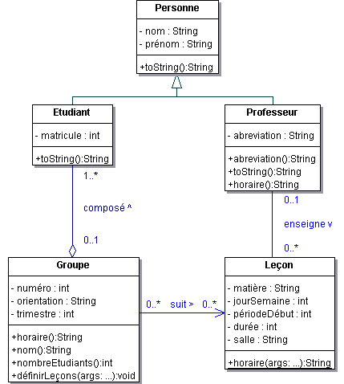

# École

_Durée du laboratoire: 4 périodes. A rendre le mardi 16 novembre 2021, au début de la séance de laboratoire._

Le diagramme de classes UML fourni ci-dessous s’inspire de la donnée
du laboratoire 1 (en particulier les départements, et donc leurs
doyens, n’y sont pas représentés).
 


Implémenter ce diagramme des classes en prenant garde à bien
factoriser les traitements et en ne pas compromettant pas
l’encapsulation des données.

Définir une classe de test contenant la méthode `main()` de
l’application.

1. Définir les professeurs _Claude Evequoz (CEZ)_ et _Pier Donini
   (PDO)_.

2. Définir les trois leçons du cours de _POO1 (PDO)_, la leçon du
   cours _PLP (CEZ)_ ainsi qu’une leçon _TIC_ (projet non encadré).

3. Définir les étudiants _John Lennon_, _Paul Mc Cartney_, _Ringo
   Starr_, _George Harisson_, _Roger Waters_ et _David Gilmour_.

4. Définir un groupe _IL6-1_ contenant les quatre premiers étudiants
   et un groupe _TS6-1_ contenant les deux derniers.

5. Affecter au groupe _IL6-1_ toutes les leçons existantes. Affecter
   au groupe _TS6-1_ toutes les leçons de _POO1_.

6. Définir un tableau contenant toutes les personnes et en afficher
   les éléments en tirant parti du mécanisme de liaison dynamique.

7. Afficher les informations relatives au groupe _IL6-1_ (nom, nombre
   d’étudiants, horaire).

8. Afficher l’horaire du professeur _PDO_.

### Indications

* Hormis les constructeurs, toutes les méthodes publiques nécessaires
  au programme sont décrites dans le diagramme de classes (on ne
  s’interessera pas ici à la modification de l’état des objets créés).

* D’autres méthodes (non publiques) peuvent toutefois se révéler
  nécessaires.

* La méthode `horaire()` dans la classe `Leçon` est statique
  (indépendante de tout objet).

* La méthode statique `format()` de la classe String permet d’obtenir
  une chaîne de caractères formattée (de manière analogue à la
  fonction `fprintf` en C/C++).

* Une méthode statique s’invoque en préfixant la méthode par le nom de
  la classe où elle est définie (p.ex. `String.format("%10s %2d", foo,
  42);`)

* Penser à utiliser les tableaux pour gérer les collections d’objets.

### Sortie du programme

```
-- Membres de l'ecole

Prof. Pier Donini (PDO)
Prof. Claude Evequoz (CEZ)
Etud. John Lennon (#1234) - IL6-1
Etud. Paul Mc Cartney (#2341) - IL6-1
Etud. Ringo Starr (#3241) - IL6-1
Etud. George Harisson (#4321) - IL6-1
Etud. Roger Waters (#1324) - TS6-1
Etud. David Gilmour (#4312) - TS6-1

-- Horaire du groupe IL6-1 (4 etudiants)

     | Lun         | Mar         | Mer         | Jeu         | Ven         |
     |-------------|-------------|-------------|-------------|-------------|
 8:30|             |             |             |             |             |
     |-------------|-------------|-------------|-------------|-------------|
 9:15|             |             |             |             |             |
     |-------------|-------------|-------------|-------------|-------------|
10:25|             |             |POO1  G02 PDO|POO1  G03 PDO|             |
     |-------------|-------------|             |             |-------------|
11:15|             |             |             |             |             |
     |-------------|-------------|-------------|-------------|-------------|
12:00|             |             |             |             |             |
     |-------------|-------------|-------------|-------------|-------------|
13:15|             |             |POO1  H01 PDO|             |             |
     |-------------|-------------|             |-------------|-------------|
14:00|             |             |             |             |             |
     |-------------|-------------|-------------|-------------|-------------|
14:55|             |             |PLP   H01 CEZ|             |             |
     |-------------|-------------|             |-------------|-------------|
15:45|             |             |             |PLP   HO1 CEZ|             |
     |-------------|-------------|-------------|             |-------------|
16:35|             |TIC   F06    |             |             |             |
     |-------------|-------------|-------------|             |-------------|
17:20|             |             |             |             |             |
     |-------------|-------------|-------------|-------------|-------------|

-- Horaire Prof. Pier Donini (PDO)

     | Lun         | Mar         | Mer         | Jeu         | Ven         |
     |-------------|-------------|-------------|-------------|-------------|
 8:30|             |             |             |             |             |
     |-------------|-------------|-------------|-------------|-------------|
 9:15|             |             |             |             |             |
     |-------------|-------------|-------------|-------------|-------------|
10:25|             |             |POO1  G02 PDO|POO1  G03 PDO|             |
     |-------------|-------------|             |             |-------------|
11:15|             |             |             |             |             |
     |-------------|-------------|-------------|-------------|-------------|
12:00|             |             |             |             |             |
     |-------------|-------------|-------------|-------------|-------------|
13:15|             |             |POO1  H01 PDO|             |             |
     |-------------|-------------|             |-------------|-------------|
14:00|             |             |             |             |             |
     |-------------|-------------|-------------|-------------|-------------|
14:55|             |             |             |             |             |
     |-------------|-------------|-------------|-------------|-------------|
15:45|             |             |             |             |             |
     |-------------|-------------|-------------|-------------|-------------|
16:35|             |             |             |             |             |
     |-------------|-------------|-------------|-------------|-------------|
17:20|             |             |             |             |             |
     |-------------|-------------|-------------|-------------|-------------|
```

## Compilation et execution

### Maven

```
# Clean build
mvn clean

# Compile le code java
mvn compile

# Executer les tests
mvn test

# Executer l'application
mvn exec:java -Dexec.args="Arguments de ligne de commande...."

# Packaging de l'application dans un fichier .jar
mvn package
```
