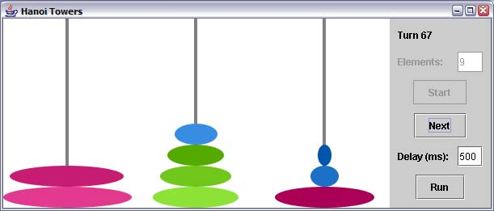

# Tours de Hanoï

_Durée du laboratoire: 8 périodes. A rendre le vendredi 10 décembre 2021, au début de la séance de laboratoire._

Le problème des tours de Hanoï dérive d’une antique légende hindoue: 

_Dans le grand temple de Brahmâ à Bénarès, sous la coupole qui marque
le centre du monde, repose un socle de cuivre équipé de trois
aiguilles de diament. Au commencement du monde 64 disques d’or étaient
enfilés sur une aiguille, les plus grands en bas et les plus petits en
haut, et formaient la Tour de Brahmâ. Les moines les déplacent, un à
la fois, d’une aiguille à l’autre en suivant l’immuable loi de Brahmâ:
aucun disque ne peut être posé sur un autre disque plus petit. Quand
lma Tour de Brahmâ sera finalement reconstruite sur une aiguille
différente de celle d’origine le monde tombera en poussière et
disparaîtra._

1. En supposant des moines surentraînés capables de déplacer un disque
   à la seconde, combien de temps reste-t-il avant que l’univers
   disparaisse (celui-ci a actuellement 13.7 milliards d’années) ?

2. Définir une classe `Pile` permettant de représenter une pile
   générique (capable de stocker un nombre quelconque d’objets)
   offrant les opérations suivantes:

    * empiler un objet sur le sommet de la pile,

    * désempiler un objet du sommet de la pile,

    * obtenir la représentation sous la forme de chaîne de caractères
      du contenu de la pile,

    * obtenir un tableau d’objets représentant l’état actuel de la
      pile (l’indice 0 contenant l’élément placé au sommet de la
      pile),

    * obtenir un itérateur sur la pile qui offre les opérations
      `suivant()` et `possedeSuivant()` permettant de parcourir le
      contenu de la pile associée.

    Ecrire un programme de test mettant en oeuvre toutes les
    fonctionnalités de ces classes.

3. Définir une classe `Hanoi` représentant les trois aiguilles et
   leurs disques et offrant la possibilité de déplacer tous les
   disques de la première aiguille à la troisième autre en respectant
   les contraintes décrites plus haut.

    Ecrire un programme de test résolvant le problème pour un nombre
    de disques défini par l’utilisateur (en argument de la ligne de
    commande) et affichant les états successifs des aiguilles.


        > java Hanoi 4

        -- Turn: 0
        One:   [ <1> <2> <3> <4> ]
        Two:   [ ]
        Three: [ ]
        -- Turn: 1
        One:   [ <2> <3> <4> ]
        Two:   [ <1> ]
        Three: [ ]

        ...

        -- Turn: 15
        One:   [ ]
        Two:   [ ]
        Three: [ <1> <2> <3> <4> ]

   

4. Définir la classe `Pile` comme classe du paquetage `util` et
   modifier le code existant et l’arborescence des repertoires en
   conséquence.

5. Afin de pouvoir s’interfacer avec la classe graphique `JHanoi`
   (fournie en annexe dans le paquetage `hanoi.gui`), modifier la
   classe `Hanoi` et définir une classe `HanoiDisplayer` permettant
   d’afficher une instance de la classe `Hanoi`.

    La classe `HanoiDisplayer` doit appartenir au paquetage `hanoi` et
    offrir la méthode:

    * `public void display(Hanoi h)`  
      Affiche l’état des aiguilles de l’instance de la classe
      Hanoi. Par défaut laffichage se fait à la console.

    La classe `Hanoi` doit appartenir au paquetage `hanoi` et offrir
    (entre autres) les méthodes suivantes:

    * `public Hanoi(int disks, HanoiDisplayer displayer)`  
      Constructeur générique.

    * `public Hanoi(int disks)`  
      Constructeur pour l’affichage à la console.

    * `public void solve()`  
      Déplace tous les disques de la première aiguille à la troisième en
      affichant les états successifs des aiguilles au moyen de l’instance
      HanoiDisplayer sélectionnée.

    * `public int[][] status()`  
      Rend un tableau de tableaux représentant l’état des aiguilles. Pour
      un tel tableau `t`, l’élément `t[i][j]` correspond à la taille du
      _j_-ème disque (en partant du haut) de la _i_-ème aiguille.

    * `public boolean finished()`  
      Rend `true` si la solution du problème a été atteinte, `false` sinon.

    * `public int turn()`  
      Rend le nombre de disques déplacés.

    La classe `JHanoi` invoque les méthodes ci-dessus sur une instance
    de la classe `Hanoi` gérée par ses soins. A l’appui du bouton
    `Start` une instance de la classe `Hanoi` est créée (avec comme
    afficheur une sous-classe de la classe `HanoiDisplayer` gérant le
    graphisme) et sur laquelle est invoquée la méthode `solve()`.  La
    classe `JHanoi` possède le constructeur: `public JHanoi()`.

6. Modifier le programme de test afin de gérér les deux modes de
   représentation (console et graphique).

### Rendu

Le rapport contiendra notamment le diagramme des classes et la
description des classes, la description de l’algorithme utilisé, la
réponse (justifiée) à la question posée ainsi que les sources du
programme.

## Compilation et execution

### Maven

```
# Clean build
mvn clean

# Compile le code java
mvn compile

# Executer les tests
mvn test

# Executer l'application
mvn exec:java  -Dexec.classpathScope=compile -Dexec.args="Arguments de ligne de commande...."

# Packaging de l'application dans un fichier .jar
mvn package
```

