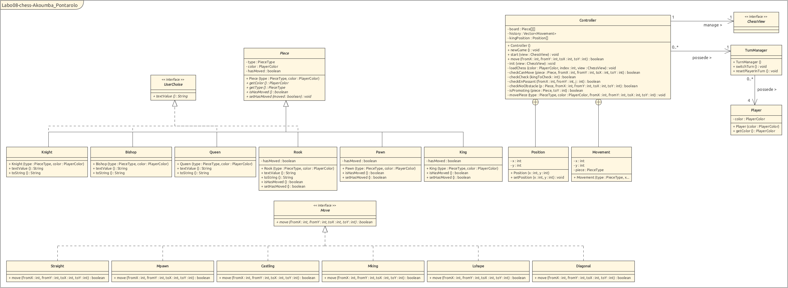

`Auteurs : Akoumba Erica Ludivine, Stefano Pontarolo`

# Rapport Labo08_CHESS

## Introduction

Dans le cadre de ce laboratoire, il nous a été demandé de mettre en oeuvre le jeu d'échecs. Une structure de base a été mise à notre disposition à cet effet. Afin de réaliser le travail demandé, nous avons commencé par élaborer un diagramme de classe , ensuite nous avons implémenté une solution respectant ledit diagramme des classes.

## Diagramme des classes

Ci- après le diagramme des classes.

## Choix d'implémentation.

Afin de réaliser le travail demandé, plusieurs alternatives s'offraient à nous. Nous avons fait le choix de :

- avoir une interface `Move` qui represent un mouvement, ainsi les différents mouvements pouvant être effectués dans le jeu implémente celle-ci.
- Nous avons des classes comme `player` qui pourrait être encore plus utile pour l'évolutivité de l'application. La gestion du score pourrait être ajouté par exemple.
- Nous avons choisi d'implémenter un `TurnManager` pour la gestion des tours entre les joueurs.
- Le coeur de l'application cad la logique toute entière du jeu est assurée par le `Controller`. C'est dans cette classe que la logique du jeu est implémentée. Nous aurions pu faire que chaque `Pièce` puisse informer le `Controller` des mouvements qu'elle peut effectuer. Mais nous avons choisi de laisser la classe pièce aussi simple que possible. Dans notre implémentation, une pièce renseigne juste sur son type, sa couleur et si elle a bougé. Le `Controller` quant à lui dans un switch en fonction de la pièce, appelle les mouvements qu'il permet à la pièce de faire. Ainsi ajouter un mouvement à une pièce revient simplement à ajouter dans le switch sur la pièce en question le mouvement additionnel.

## Tests effectués

Afin de tester le bon fonctionnement de notre jeu, nous avons effectués les tests ci-après :

- Les pièces ne peuvent être déplacées qu'à son propre tour => test réussi  
- Les pièces ne peuvent pas se déplacer s'il y a une autre pièce au milieu => test réussi  
- Les pièces ne peuvent pas se déplacer sur une case où se trouve une pièce amie => test réussi.  
- Le pion ne peut être déplacé par deux que lors de leur premier mouvement => test réussi  
- Le pion peut se déplacer d'un seul coup vers l'avant => test réussi  
- Le pion peut capturer en diagonale => test réussi  
- Le pion peut capturer en-passant => test réussi  
- Le pion peut être promu => test réussi  
- La tour peut se déplacer en ligne droite d'un nombre illimité de cases dans les deux sens => test réussi  
- Le chevalier peut se déplacer en forme de L => test réussi  
- Le fou peut se déplacer en diagonale d'un nombre illimité de cases dans les deux sens => test réussi  
- La reine peut se déplacer comme une tour et un fou => test réussi  
- Le roi peut se déplacer comme une reine, mais seulement d'une case => test réussi  
- Le roi peut faire un château court/long => test réussi  
- Les pièces ne peuvent pas se déplacer si leur mouvement met leur roi en échec => test réussi.  
- Si le roi est en échec, on ne peut pas déplacer une pièce qui n'enlève pas l'échec => test réussi. 
- Le roi peut se déplacer seulement s'il ne va pas en échec => test réussi
- Le roi peut faire le château seulement s'il n'est pas en échec => test réussi  
ou si une case sur le chemin n'est pas traitée => test raté.  

## Conclusion

Ce laboratoire nous aura permis de mettre en pratique les notions de classes, classes internes, Enum, interfaces.. Nous n'avons pas eu de difficultés particulières si ce n'est la mise en place de la structure que nous voulions donner à notre application.
